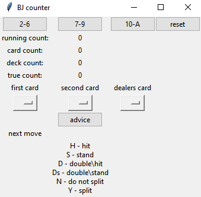

# Blackjack counter with basic strategy without accounting deviation

Basic manual black jack counter with basic strategy. Program is based on running count.

##### TODO

1. account for deviation of true count*
2. add keyboard shortcuts for adding / subtracting (after some testing it is painful to click)
3. add input for already played cards (deferred / discarded cards)
4. work on design (not soon probably)
5. automate, use image processing (not soon)
6. add player advantage (%)

*you can easily account for the deviation by playing with positive true count only

#### Preview

#### Review

After some testing it is not that bad of a tool. Button clicking gets painful over time and the missing possibility of adding discarded cards is not making it better, but if you input cards and get information about basic strategy then the true count can help you decide (positive number means there is bigger probabilty of large numbers and vice versa).
