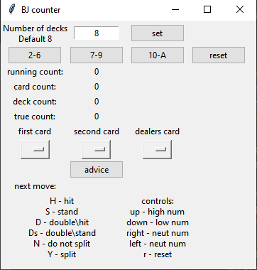

# Blackjack counter with basic strategy without accounting deviation

Basic manual black jack counter with basic strategy. 

##### TODO

1. account for deviation of true count*
2. automate, use image processing (not soon)

*you can easily account for the deviation by playing with positive true count only

#### Preview

